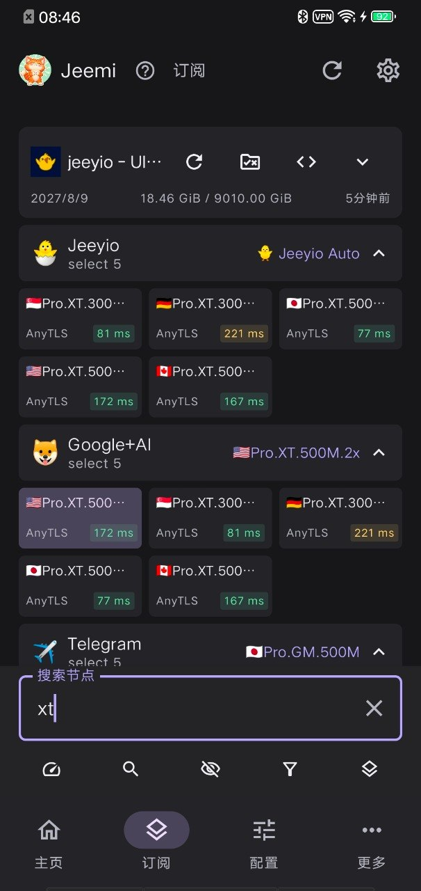

# Jeemi Android

一个基于 mihomo 的开源 Android VPN 客户端，使用 Kotlin、Compose 与 Go，支持 Android 8.0（API 26）及以上的手机和平板。安卓原生界面，耗电低！不同订阅关联不同(相同)本地脚本、规则配置、链式代理关联方式，高灵活度实现自定义订阅配置。

支持规则/远程节点与策略组图片的持久缓存、首页本地 zashboard 面板入口、脚本 URL 导入/刷新，以及嵌套选择器逐层浏览与完整出口路径。运行中配置修改仍待重启生效。

## 官方交流与公告

- [Jeemi官方交流群](https://t.me/Jeemi_group)：反馈问题/交流使用。
- [Jeemi官方频道](https://t.me/Jeemi_channel)：官方更新公告。

## 下载

在 [GitHub Releases](https://github.com/bluevava/jeemi-android/releases) 下载对应架构的 APK：

- `Jeemi-Android-v版本号-arm64.apk`：ARM64 手机和平板。
- `Jeemi-Android-v版本号-amd64.apk`：x86_64 设备或模拟器。

没有通用包或 32 位包。正式发布使用同一自签名证书，附每包 SHA-256、`SHA256SUMS` 和包含证书指纹、公开源码提交的 `release.json`。安装时允许所用下载应用安装 APK；VPN 连接另由 Android 系统授权。

## 功能

- 主页控制 VPN 和出站模式，固定使用 gVisor 协议栈，管理运行参数、DNS、内核与 GEO。
- 导入订阅链接或文本，管理选择器、节点、测速与预选；支持扫码填入订阅链接。
- 策略组支持 `icon` 图片链接，图片优先；加载中或失败时回退名称开头的 Emoji，没有 Emoji 则显示默认图标。
- 本地配置、脚本、策略组、规则集与链式代理组合；保存失败保留原状态。
- 连接列表和详情、日志、DNS 查询；应用规则使用 Android 包名。
- 简体中文和英文、浅色和深色主题，手机和平板均采用竖屏单列布局。

内置 `v1.19.30-jeemi.2` 核心基于官方 mihomo v1.19.30，增加 Android VpnService FD 与应用归属桥接；两种架构携带同一固定 GEO 快照。核心来源、补丁、归档、哈希和上游许可证保留在 `resources/`。

当前设备验证主要来自 Android 16 x86_64 模拟器；ARM64 真机、API 26、16 KB 页设备和厂商后台策略仍需覆盖。曾观察到模拟器 ART 原生崩溃，Compose 固定版本不代表该问题已解决。自动订阅调度尚未实现。

## 订阅管理界面

## 致谢

- [Wails](https://github.com/wailsapp/wails)：应用框架。
- [Mihomo](https://github.com/MetaCubeX/mihomo)：代理核心。
- [jeemi-desktop](https://github.com/bluevava/jeemi-desktop)：参考项目。
- [Jeeyio](https://t.me/jeeyio_channel)：赞助支持。

构建、签名和发布方法见 [BUILDING.md](BUILDING.md)，版本说明见 [CHANGELOG.md](CHANGELOG.md)。许可证见 [LICENSE](LICENSE)。
